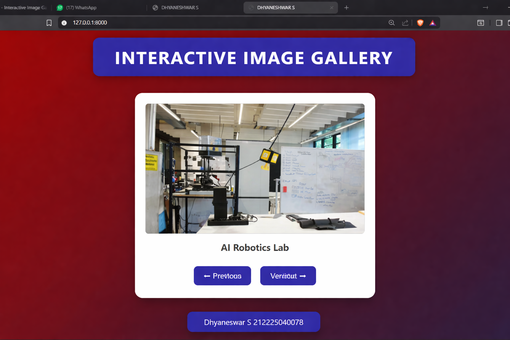

# Ex.07 Design of Interactive Image Gallery
## Date: 24/03/2026

## AIM:
To design a web application for an inteactive image gallery for a minimum five images with next and previous buttons.

## DESIGN STEPS:

### Step 1:
Clone the github repository and create Django admin interface.

### Step 2:
Change settings.py file to allow request from all hosts.

### Step 3:
Use CSS for positioning and styling.

### Step 4:
Write JavaScript program for implementing interactivity.

### Step 5:
Validate the HTML and CSS code.

### Step 6:
Publish the website in the given URL.

## PROGRAM:
```
 <html>
            <head>
                <title>DHYANESHWAR S</title>
                <style>
                    body {
                        margin: 0;
                        padding: 0;
                        background: linear-gradient(135deg, #960404, #1a1a40);
                        font-family: 'Segoe UI', Tahoma, Geneva, Verdana, sans-serif;
                        display: flex;
                        flex-direction: column;
                        justify-content: center;
                        align-items: center;
                        height: 100vh;
                    }

                    header {
                        background: #291ab0;
                        padding: 15px 40px;
                        border-radius: 12px;
                        box-shadow: 0 6px 15px rgba(0,0,0,0.3);
                    }

                    header h1 {
                        color: white;
                        margin: 0;
                        letter-spacing: 2px;
                    }

                    .gallery-container {
                        margin-top: 30px;
                    }

                    .card {
                        background: #ffffff;
                        border-radius: 15px;
                        box-shadow: 0 10px 25px rgba(0,0,0,0.3);
                        padding: 20px;
                        text-align: center;
                        width: 350px;
                        transition: transform 0.3s ease;
                    }

                    .card:hover {
                        transform: scale(1.03);
                    }

                    img {
                        width: 100%;
                        height: 220px;
                        object-fit: cover;
                        border-radius: 10px;
                    }

                    .caption {
                        margin-top: 15px;
                        font-size: 18px;
                        font-weight: bold;
                        color: #333;
                    }

                    .buttons {
                        margin-top: 20px;
                    }

                    button {
                        padding: 10px 18px;
                        margin: 5px;
                        border: none;
                        border-radius: 8px;
                        background: #291ab0;
                        color: white;
                        font-size: 14px;
                        cursor: pointer;
                        transition: 0.3s;
                    }

                    button:hover {
                        background: #ff4757;
                        transform: scale(1.05);
                    }

                    footer {
                        margin-top: 25px;
                        background: #291ab0;
                        padding: 10px 30px;
                        border-radius: 10px;
                        box-shadow: 0 6px 15px rgba(0,0,0,0.3);
                    }

                    footer p {
                        color: white;
                        margin: 0;
                        font-size: 14px;
                    }
                </style>
            </head>

            <body>

            <header>
                <h1>INTERACTIVE IMAGE GALLERY</h1>
            </header>

            <div class="gallery-container">
                <div class="card">
                    
                    <div class="caption" id="caption">3D Printing Lab</div>

                    <div class="buttons">
                        <button onclick="prevImage()">⬅ Previous</button>
                        <button onclick="nextImage()">Next ➡</button>
                    </div>
                </div>
            </div>

            <footer>
                <p>Dhyaneswar S 212225040078</p>
            </footer>

            <script>
            const images = [
                {
                    src: "exp7/exp7/3dlab.jpg",
                    text: "3D Printing Lab"
                },
                {
                    src: "exp7/exp7/ailab.jpg",
                    text: "AI Robotics Lab"
                },
                {
                    src: "exp7/exp7/compla.jpg",
                    text: "Computer Lab"
                },
                {
                    src: "exp7/exp7/eng.jpg",
                    text: "Engineering Workshop"
                }
            ];

            let index = 0;

            function showImage() {
                document.getElementById("galleryImage").src = images[index].src;
                document.getElementById("caption").innerText = images[index].text;
            }

            function nextImage() {
                index = (index + 1) % images.length;
                showImage();
            }

            function prevImage() {
                index = (index - 1 + images.length) % images.length;
                showImage();
            }
            </script>

            </body>
        </html>

```

## OUTPUT:


## RESULT:
The program for designing an interactive image gallery using HTML, CSS and JavaScript is executed successfully.
